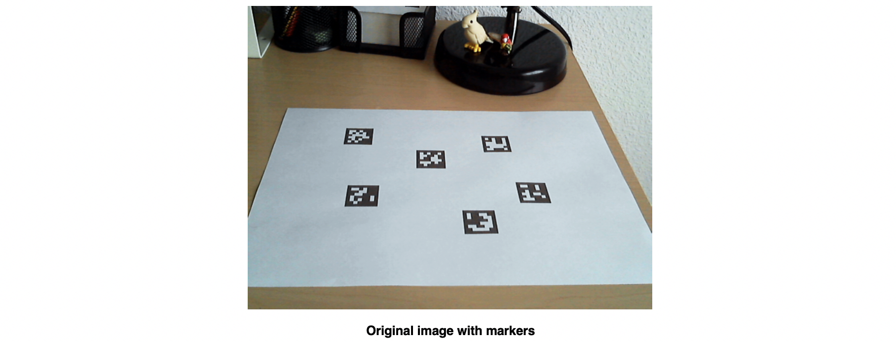
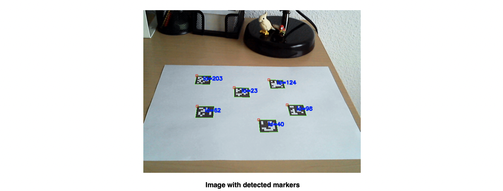

 <strong> Final Report  </strong>   <strong>-- Multi-robots Collaborative Object Transfer </strong>   

 Final Project of the graduate Course CS401: Intelligent Robots 

 Prepared by*:    羊尊瑞 11510660  刘航晨 11510722 &nbsp;&nbsp;&nbsp;&nbsp;王林 11510064 张依林 11510280   Department of Computer Science and Engineering Southern University of Science and Technology Shenzhen, Guangdong, China 518055 

### Abstract

This document illustrates the main aspect of our Intelligent Robots final project. 

### 1. Project Introduction

In recent years, robots and artificial intelligence have prospered. Robots that have been running in the laboratory have gradually entered the lives of thousands of families. Multi-robot collaboration has a huge application market, it's widely used in the fields of industrial, medicine, military and aerospace.

Through the cooperation of multiple robots, it is possible to complete complex operations that are difficult for one robot to complete. And also, the collaboration of robots brings higher time efficiency and economic benefits than independent work. When the working environment of the robot changes or even the system is partially damaged, the cooperative relationship between multiple robots can be re-established through self-organizing ability and cooperation mechanism, and the scheduled work can still be completed.

In this project, we're focus on the collaborative transportation process of multi-robots, learn related technologies, design appropriate task assignment methods and scheduling algorithms for robots.

### 2. Design and Basic Architecture

The problem of organizing multiple robots to effectively cooperate to complete a given task is mainly divided into two parts: 

#### 2.1. Tools.

The hardware platform are Mecanum-wheel robot, Hukyo Lidar and a high-performanced computer with Ubuntu 16.04.
* **Mecanum wheel** : In this project, we don’t use the turtlebot3 but the robot with Mecanum wheel. The wheel is its most unique place. It can support the robot to completing the omnidirectional rotation easily and accurately.

* **RoboRTS-Firmware MCU** : In this Main Control Unit which is based on the modification of STM32F427IIHx, it could run at a frequency of 180MHz. The communication mode of modules is CAN. There are CAN device: Motor electric modulation, gyroscope module. It can transform the general command to the specific motion of wheels.

* **Sensor** : We will choose one or some of LiveCam sensor, April-Tag and Hukyo lidar in the actual testing of our project.

  

#### 2.2. Project Design.

part.

### 3. Implementation

#### 3.1. Pose Estimation

Pose estimation is of great importance in many computer vision applications: robot navigation, augmented reality, and many more. This process is based on finding correspondences between points in the real environment and their 2d image projection. This is usually a difficult step, and thus it is common the use of synthetic or fiducial markers to make it easier.

One of the most popular approach is the use of binary square fiducial markers. The main benefit of these markers is that a single marker provides enough correspondences (its four corners) to obtain the camera pose. Also, the inner binary codification makes them specially robust, allowing the possibility of applying error detection and correction techniques.

The aruco module is based on the `ArUco` library, a popular library for detection of square fiducial markers developed by Rafael Muñoz and Sergio Garrido.

##### 3.1.1. Markers and Dictionaries

An **ArUco** marker is a synthetic square marker composed by a wide black border and a inner binary matrix which determines its identifier (id). The black border facilitates its fast detection in the image and the binary codification allows its identification and the application of error detection and correction techniques. The marker size determines the size of the internal matrix. For instance a marker size of 4x4 is composed by 16 bits.

Some examples of **ArUco** markers:

It must be noted that a marker can be found rotated in the environment, however, the detection process needs to be able to determine its original rotation, so that each corner is identified unequivocally. This is also done based on the binary codification.

A dictionary of markers is a set of markers that are considered in an specific application. It is simply the list of binary codifications of each of its markers.

The main properties of a dictionary are the dictionary size and the marker size.

- The dictionary size is the number of markers that composed the dictionary.
- The marker size is the size of those markers (the number of bits).

The **ArUco**  module includes some predefined dictionaries covering a range of different dictionary sizes and marker sizes.

One may think that the marker id is the number obtained from converting the binary codification to a decimal base number. However, this is not possible since for high marker sizes the number of bits is too high and managing so huge numbers is not practical. Instead, a marker id is simply the marker index inside the dictionary it belongs to. For instance, the first 5 markers inside a dictionary has the ids: 0, 1, 2, 3 and 4.

##### 3.1.2. Marker Detection

Given an image where some **ArUco** markers are visible, the detection process has to return a list of detected markers. Each detected marker includes:

* The position of its four corners in the image (in their original order).
* The id of the marker.

The marker detection process is comprised by two main steps:

1.	Detection of marker candidates. In this step the image is analyzed in order to find square shapes that are candidates to be markers. It begins with an adaptive thresholding to segment the markers, then contours are extracted from the thresholded image and those that are not convex or do not approximate to a square shape are discarded. Some extra filtering are also applied (removing too small or too big contours, removing contours too close to each other, etc).
2.	After the candidate detection, it is necessary to determine if they are actually markers by analyzing their inner codification. This step starts by extracting the marker bits of each marker. To do so, first, perspective transformation is applied to obtain the marker in its canonical form. Then, the canonical image is thresholded using Otsu to separate white and black bits. The image is divided in different cells according to the marker size and the border size and the amount of black or white pixels on each cell is counted to determine if it is a white or a black bit. Finally, the bits are analyzed to determine if the marker belongs to the specific dictionary and error correction techniques are employed when necessary.

Consider the following image:

These are the detected markers (in green):

##### 3.1.3. Pose Estimation

The next thing you probably want to do after detecting the markers is to obtain the camera pose from them.

To perform camera pose estimation you need to know the calibration parameters of your camera. This is the camera matrix and distortion coefficients. If you do not know how to calibrate your camera, you can take a look to the `calibrateCamera()` function and the Calibration tutorial of OpenCV. You can also calibrate your camera using the aruco module as it is explained in the Calibration with aruco tutorial. Note that this only need to be done once unless the camera optics are modified (for instance changing its focus).

At the end, what you get after the calibration is the camera matrix: a matrix of 3x3 elements with the focal distances and the camera center coordinates (a.k.a intrinsic parameters), and the distortion coefficients: a vector of 5 elements or more that models the distortion produced by your camera.

#### 3.2. Path Planning

##### 3.2.1. Algorithm

At present, for not too big, not too many boxes of checkpoints, there are many programs can find the answer. However, pushing boxes has been proved to be PSPACE-complete by mathematicians and computer scientists, that is to say, there is basically no fast (polynomial time) solving algorithm. For the bigger hurdles, today's personal computers are powerless. For the algorithm design in this experiment, we mainly adopt **A* algorithm**. The cost of the algorithm is the number of rounds that have been moved in this scenario, plus the distance sum of each box and the nearest target point. In this process, we introduce a concept: scene. That is to say, the same scenario in this algorithm is regarded as the same scenario in **A* algorithm**. The best criterion for judging situation repetition is not that the situation is completely consistent, but that the coordinates are in the same order and the role coordinates are accessible.

As shown below, no matter how the characters move, they can return to their original position without pushing the box. This is the same situation.

Again, as shown below, the two boxes swap positions, and the result is the same as that without moving boxes, so the same is true after sorting the box coordinates.

Then，we will introduce the data structure and the basic algorithm logic in this experiment.

##### 3.2.2. Data Structure

1. `char [][]` stores maps, where data is represented in push box format.
2. Mypoint: Record coordinates.
3. Situation: Record the scene.
4. Graph: Convert the map `char [][]` into an adjacency matrix to store the map. **A* algorithm** usage
5. Node: **A* algorithm** is used to save nodes when finding a path.
6. SimpeSitu: Used to simplify the situation and reduce memory usage.

##### 3.2.3. Algorithmic logic:

1. Initialize the queue and extract the first scene to the current scene (Situation class)
2. All boxes in the current scenario are located, and the function returns the current situation.
3. Analyse the scenario (which box and direction a person moves) to get several new scenarios, filter repetitions (a collection class is needed to save the arrived scenarios) and judge: if the box is in a dead knot (where the box can't be moved again after arrival), filter the current scenario (not added to the queue)
4. If the number of new scenarios is zero after filtering, the scenario will be confused and the scenario will be deleted (see the next article for optimization).
5. Add a new scene to the queue, analyze the next scene in the queue, repeat 2-4
6. If the number of queue scenarios is zero, the scenario is unresolved (or the queue is too small and the memory is insufficient), return null.

Generally speaking, there are still some gaps between the box pushing algorithm and other intelligent algorithms. According to the traversal algorithm adopted in this program, it needs to filter non-repetitive paths, and if it wants to filter, it must record the state of the paths it has traveled. According to the simple arrangement and combination, it will know that there will be a huge variety of situations (for example, 6 boxes on the map of 10\*10, thick). There are slightly (100) six-power possibilities, so a strong filtering algorithm is needed to complete the calculation. However, if heuristic search algorithm is not used instead of traversal search, there is a duplicate path problem in pushing boxes, which can not be solved by the algorithms I have come into contact with at present.