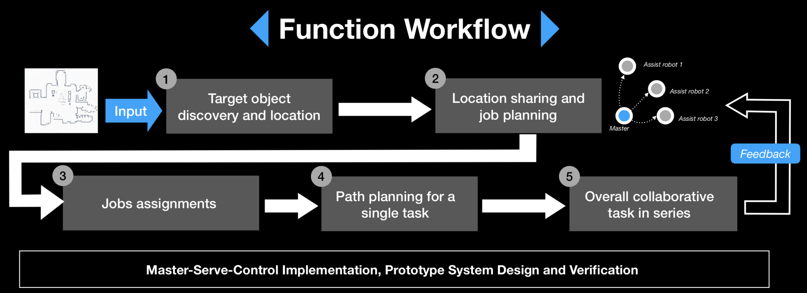
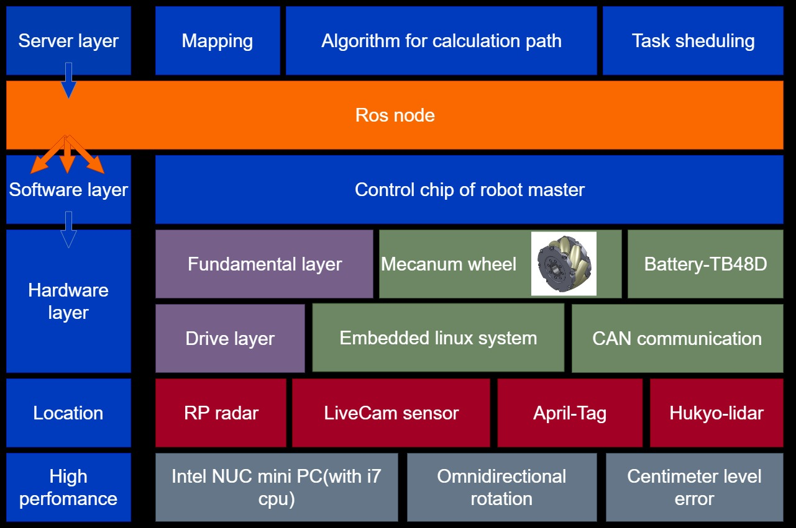
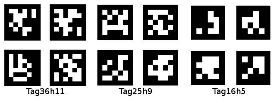
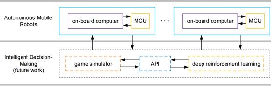
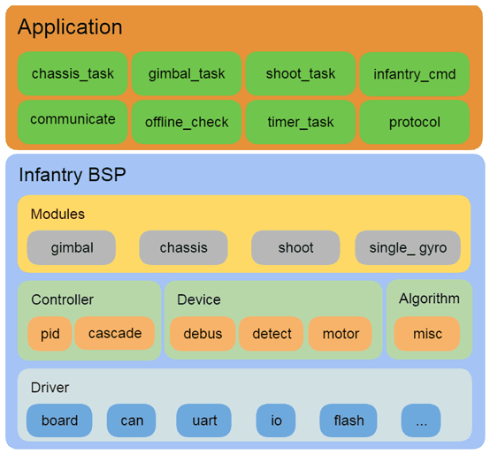

 <strong> Thesis Proposal  </strong>   <strong>-- Multi-robots Target detection and Tracking </strong>   

 A Proposal Prepared for the  Final Project of the graduate Course CS401: Intelligent Robots 

 Prepared by*:    羊尊瑞 11510660  刘航晨 11510722 &nbsp;&nbsp;&nbsp;&nbsp;王林 11510064 张依林 11510280   Department of Computer Science and Engineering Southern University of Science and Technology Shenzhen, Guangdong, China 518055 

#### 1. Background and Motivation

In recent years, robots and artificial intelligence have prospered. Robots that have been running in the laboratory have gradually entered the lives of thousands of families. Multi-robot collaboration has a huge application market, it's widely used in the fields of industrial, medicine, military and aerospace.

Through the cooperation of multiple robots, it is possible to complete complex operations that are difficult for one robot to complete. And also, the collaboration of robots brings higher time efficiency and economic benefits than independent work. When the working environment of the robot changes or even the system is partially damaged, the cooperative relationship between multiple robots can be re-established through self-organizing ability and cooperation mechanism, and the scheduled work can still be completed.

In this project, we're going to focus on the collaborative transportation process of multi-robots, learn related technologies, design appropriate task assignment methods and scheduling algorithms for robots.

#### 2. Related Work and Novelty of This Work

Robot positioning is the problem of estimating robot coordinates relative to an external reference frame. Given the environmental map, the robot needs to refer to the sensor data to locate its relative position on the map. For example, there are three identical doors in the known environment. The task of the robot is to find out where it is by detecting and moving.

#### 3. System Setup and Problem Statement

Given several target objects and a target position, the goal is to transfer these objects to the target position. Several robots complete this task through cooperation by dividing responsibilities, each robot only finish a part of work. Given a target object and a target position, the goal is to transfer the object to the target position. Several robots start from their current position to complete this task through cooperation.

The problem of organizing multiple robots to effectively cooperate to complete a given task is mainly divided into two parts: The recognition and positioning of the robot to the target and task assignment for different robots. This will be discussed in detail in section 4.

#### 4. Proposed Design and Methods

**4.1 System design**

First, the server will generate a map which include the location of the robot, the location of the obstacle, and the location of the boxes. Then the path planning algorithm will be used to calculate how the robots should work together to efficiently move boxes to their destinations without colliding with each other. Each robot will then be given its own operation and path through ros node. The robot analyzes the situation through the commands it receives and its own sensors and at last accurately completes the task.

**4.2 The recognition and positioning of the robot to the target.**

Amcl's English full name is adaptive Monte Carlo localization, which is actually an upgraded version of Monte Carlo positioning method, using adaptive KLD method to update particles, here is no more to say (mainly I am not familiar with), interested can Go see: KLD.

The mcl (Monte Carlo positioning) method uses a particle filtering method for positioning. The particle filter is very shallow. It is a very uniform scattering of particles in the map space, and then moving the particles by acquiring the motion of the robot. For example, the robot moves forward one meter, and all the particles move forward one meter. No matter what the position of the particle is right now. Each sensor is simulated with a sensor information that is compared to the observed sensor information (typically a laser) to give each particle a probability. The particles are then regenerated based on the generated probability, and the higher the probability, the greater the probability of generation. After this iteration, all the particles will slowly converge together and the exact position of the robot will be derived.

**4.3 Task assignment for different robots.**

The most core part of the A* algorithm lies in the design of its evaluation function:

f(n)=g(n) h(n)

Where f(n) is the estimate of each possible test point, which consists of two parts:

Part, g(n), which represents the cost from the starting search point to the current point (usually represented by the depth of a node in the search tree).

The other part, h(n), represents the most important part of the heuristic search, that is, the current node to the target node's estimate, h(n) design is good or bad, directly affecting this heuristic function. Whether the heuristic algorithm can be called the A* algorithm. A sufficient condition for a heuristic algorithm with f(n)=g(n) h(n) strategy to become an A* algorithm is:

1. There is an optimal path from the starting point to the ending point in the search tree.

2. The problem domain is limited.

3. The search value of the child nodes of all nodes is >0.

4. h(n)=<h\*(n) (h\*(n) is the value of the actual problem).

When all four conditions are satisfied, a heuristic algorithm with f(n)=g(n) h(n) strategy can become the A* algorithm and the optimal solution can be found. For a search problem, obviously, conditions 1, 2, and 3 are easy to satisfy, and condition 4: h(n)<=h\*(n) is carefully designed because h*(n) is obviously impossible. I know, so a heuristic strategy h(n) that satisfies condition 4 is very valuable. However, for the optimal path search and eight-digital problem of graphs, some related strategies h(n) are not only well understood, but have theoretically proved to satisfy condition 4, which plays a decisive role in the promotion of this algorithm.

#### 5. Hardware and Software Platform

**5.1 Hardware**

The hardware platform are Mecanum-wheel robot, Hukyo Lidar and a high-performanced computer with Ubuntu 16.04.

- Mecanum wheel

In this project, we don’t use the turtlebot3 but the robot with Mecanum wheel. The wheel is its most unique place. It can support the robot to completing the omnidirectional rotation easily and accurately. 

- RoboRTS-Firmware MCU

In this Main Control Unit which is based on the modification of STM32F427IIHx, it could run at a frequency of 180MHz. The communication mode of modules is CAN. There are CAN device: Motor electric modulation, gyroscope module. It can transform the general command to the specific motion of wheels. 

- Sensor

We will choose one or some of LiveCam sensor, April-Tag and Hukyo lidar in the actual testing of our project.

- Other hardware

The location between the robots and boxes is also important. The AprilTag landmark will be used to assist locate the box. Our robot ROS-installed computer is also high-performance which equipped with Intel i7 CPU. And then Our robots will use TB48D battery which support sufficient power to complete work. 

**5.2 Software Platform**

We may use AprilTag to locate the boxes inthe process of tasks. AprilTag is a visual reference library widely used in AR,robot and camera calibration fields. With a specific logo (similar to a qr codebut with reduced complexity to meet real-time requirements), the logo can bequickly detected and its relative position calculated.

We use RoboRTS as our software stack. It is open source which is developed by RoboMaster and motivated by RoboMaster AIChallenge. This can be divided in to the autonomous mobile robot layer andintelligent decision-making layer.

In the autonomous mobile robot layer, the robot can complete some tasks easily with the official support. Perception, motion planning and decision modules are run in thislayer and it is fully supported by some community where there are some examples. On its MCU, we implemented an RT low-level robot controller to control the robot driving system. This is our main layer in this project. Intelligent decision-making layer includes a multi-agent decision-making framework and a game simulator. 

Our firmware of the RoboRTS using an open source freertos operating system and standard CMSIS-RTOS interface to make program migration easier. It also provide a set of abstract infantry robot BSP to simplify the upper logic;

**Driver:** directly operates the device drivers of the underlying hardware,adding mechanisms such as locking and asynchrony on the basis of libraryfunctions and registers to provide a more easy-to-use API.

**Device:** an external module with one or more bus inputs, one or more dataoutputs, or a generic software module (drop protection).At present, the driverof RM materials is abstracted into equipment.

**Controller:** single input single output model, providing some common callinterface, changing different control algorithms depends on differentregistration functions.

**Algorithm:** provides the module Algorithmwith no interdependence between basic files.

**Module:** a Module composed of driver, device, controller and algorithm thatcan realize a particular function.For example, the two-axis cradle headcomposed of RM motor and the wheel-wheel chassis composed of RM motor.

**Utilities:** generic system components, such as the log system.

**Protocol:** a set of upper - and low-level communication protocols for interfaces.

**Application:** upper Application logic, including mode switching.

#### 6. Goals, Metrics an Timeline

In preliminary stage, we might focus on the basic knowledge of ROS, the RobotMaster MCU and get familiar with Linux Operation System and etc. The function we want to achieve in this project is mainly the cooperative work of multiple robots, so the part of task scheduling and the part of robot communication are the most critical parts. When there are some rough result occur(The master robot could locate the target boxes and assign the right task to the corresponding robots), the main work at that time is testing as well as create different map field and task modes.

To measure or evaluate the qulity of our project. In the initial stage of the project, we should do some work in the multi-robot communicationa and AprilTag recognition. So the accuracy of recognition and feasible of network communication will be the standard. However, if the test time is reached, the efficiency of our algorithm might be the metrics. 

About the timeline, we could divide it into three stages. Firstly, learning of basic knowledge of ROS operation system and Mecanum-wheel robot, most of time might used for toturial and practical test of these hardware connection. Secondly, paper reading and algorithm understanding or designing might be the key. The last stage, we will more focus on the real-world experiment.

#### 7. Staff Planning

WANG Lin:

● Assemble our robot and other hardware;

● Install the Linux system on the remoted server;

● Install the ROS system on the master and others;

● Paper Reading and Literature Review;

● System Setup, Basic Robot Operation;

● Writing part of the report

ZHANG Yilin:

● Assemble our robot and other hardware;

● Install the Linux system on the remoted server;

● Install the ROS system on the master and others;

● Paper Reading and Literature Review;

● System Setup, Basic Robot Operation;

● Writing part of the report

YANG Zunrui:

● Assemble our robot and other hardware;

● Install the Linux system on the remoted server;

● Install the ROS system on the master and others;

● Paper Reading and Literature Review;

● Self-Localization Implementation;

● Writing part of the report

LIU Hangchen:

● Assemble our robot and other hardware;

● Install the Linux system on the remoted server;

● Install the ROS system on the master and others;

● Paper Reading and Literature Review;

● Route Planning Algorithm;

● Writing part of the report

#### 8. Reference

[1] Dieter Fox. A Probabilistic Approach To Collaborative Robot Localization [J]. Autonomous Robots,2008,8:325-344

[2] Khatib O. Real-time Obstacle Avoidance for Manipulators and Mobile Robots [J] . The International Journal of Robotics Research,1986,5(1) : 90-98